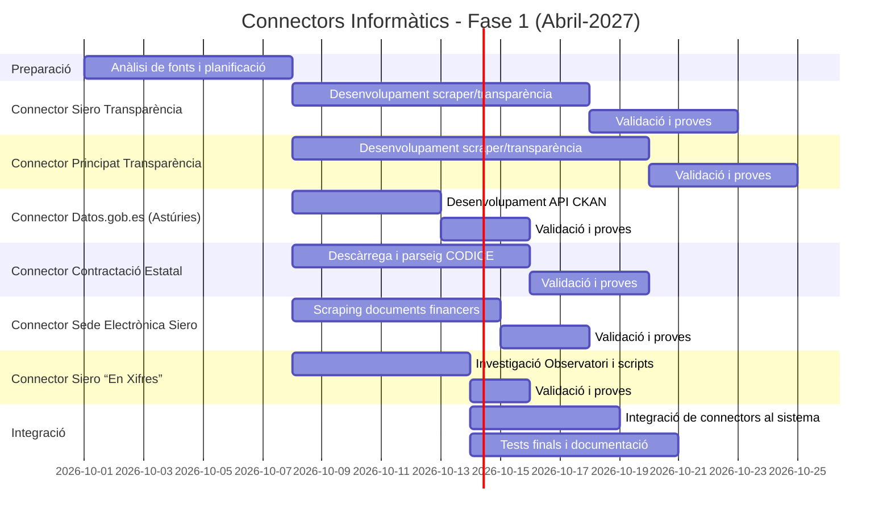

# Resum executiu

Aquest informe recull els portals i fonts oficials pertinents per a una app d’auditoria ciutadana centrada en l’Ajuntament de Siero (Pola de Siero, Astúries) i el Govern del Principat d’Astúries. S’han identificat els portals de transparència, contractació pública, pressupostos, subvencions, padró i tributs, tant locals com autonòmics. Es descriuen els punts d’accés disponibles (APIs, portals de dades obertes o pàgines web), amb la freqüència d’actualització i els formats de dades (PDF, CSV, JSON, etc.). També es detallen els esquemes de dades suggerits, exemples de codi per a cridar APIs i fer web scraping robust (amb Python `requests`, `BeautifulSoup` i patrons de Scrapy), i recomanacions legals (respectar *robots.txt*, llicències, atribució i cache). Finalment, es proposa un cronograma (Gantt) per implementar els sis connectors prioritaris.

# 1. Inventari de portals oficials

S’han localitzat els portals següents per a Siero i per a l’Administració autonòmica asturiana. La taula resumeix l’URL, propietari, freqüència d’actualització (si es coneix), formats de dades i mètode d’accés:

| Portal/Font                                        | URL                                                          | Propietari                       | Freqüència  | Formats                  | Accés            |
|----------------------------------------------------|--------------------------------------------------------------|----------------------------------|-------------|--------------------------|------------------|
| **Ajuntament de Siero – Portal Transparència**     | `https://www.ayto-siero.es/portal-de-transparencia/`         | Ajuntament de Siero              | No especificada | HTML, enllaços PDF/XLS   | Web (pàgina HTML) |
| **Aj. Siero – Presupostos Municipals (Sede Electr.)** | `siero.sedelectronica.es` (Sede Electrònica de Siero)      | Ajuntament de Siero              | Anual (*)     | PDF, HTML                | Web (HTML)       |
| **Aj. Siero – Contractes menors (Transparència)**  | *link des del portal transparència* (PDF)                   | Ajuntament de Siero              | No especificada | PDF                      | Web (descarrega) |
| **Aj. Siero – Subvencions (BDNS nacional)**        | `www.pap.hacienda.gob.es/bdnstrans/GE/` (BDNS Estatal)       | Ministeri Hisenda espanyol       | Actualitz. periòdic | HTML (formularis)   | Web (formulari)  |
| **Aj. Siero – Dades generals (‘Siero en xifres’)**  | `https://www.ayto-siero.es/siero-en-cifras/`                 | Ajuntament de Siero              | No aplicable  | HTML (textual)           | Web (HTML)       |
| **Principat – Portal Transparència**               | `https://transparencia.asturias.es/`                         | Govern del Principat d’Astúries  | Continuïtat   | HTML, PDF                | Web (HTML)       |
| **Principat – Perfils de contratant**              | (via miPrincipado) eg. `miprincipado.asturias.es/perfil-del-contratante` | Govern del Principat d’Astúries  | Continual    | HTML, llistats (HTML)    | Web (HTML)       |
| **Principat – Dades Obertes (datos.gob.es)**       | `https://datos.gob.es/…?publisher_display_name=Principado+de+Asturias` | Govern del Principat d’Astúries | Variable     | XLS/CSV/JSON/HTML etc.   | API (CKAN), Web |
| **Principat – Estadístiques d’Astúries**          | `https://transparencia.asturias.es/estadisticas-asturias`    | Govern del Principat d’Astúries  | No disponible  | HTML                     | Web              |
| **Principat – BOPA (Butlletí Oficial)**           | `https://sede.asturias.es` (miBOPA)                         | Govern del Principat d’Astúries  | Diari (8/2026) | PDF                     | Web/API (RSS)    |
| **Principat – Sede Tributs**                      | `https://sede.tributasenasturias.es/`                        | Govern del Principat d’Astúries  | No aplicable  | HTML (formularis)        | Web (HTML)       |
| **Principat – Portal Contratació**                | `https://contrataciondelestado.es/` (Sector Públic)         | Govern Espanyol (MITERD)         | Diari (CODICE) | CODICE (XML), JSON       | Web/API (CODICE) |
| **Principat – Astrosits i altres**                | (ex.: `asturiasparticipa.asturias.es`, altres)                | Govern del Principat d’Astúries  | —            | HTML/Web                 | Web              |

(*) Alguns ajuntaments publiquen els pressupostos anuals en la Sede Electrònica. Siero sembla usar la seva seu electrònica per a això.  

**Cites:** El portal de transparència de Siero inclou enllaços a “Contratos menores formalizados” i a “Subvenciones y ayudas públicas concedidas”. El portal de transparència del Principat llista apartats dedicats a pressupostos, comptes, contractació i subvencions. Al portal central de “Datos Abiertos” s’hi troben 671 conjunts de dades publicats pel Principat. 

# 2. APIs i scraping per a cada portal

Per a cada font s’ha evaluat si hi ha un API o, en cas contrari, les pàgines HTML candidates per fer web-scraping. A continuació es resumeixen els punts d’accés principals i els elements clau a extraure:

- **Portal Transparència Siero:** No hi ha API pública. Les seccions es troben en HTML amb enllaços a documents (PDF/Excel). Per exemple, la pàgina de “Contratos menores formalizados” ofereix PDFs descarregables. Es farien peticions `requests.get` a URLs com `https://www.ayto-siero.es/descarga/…/contratos-menores-ayto.pdf` i es processarien amb PyPDF2 o pdfplumber per extreure camps. Per exemple, l’arxiu PDF enumerat conté camps com *Núm. expedient, data, import, empresa*, etc. Cal identificar-los i mapar-los a col·lumnes. Altres apartats (p.ex. subvencions) apunten al BDNS estatal (formulari web), que no té API oberta, així que caldria fer scraping de la pàgina `pap.hacienda.gob.es` simulant cerques (tenant en compte cookies i limitacions).

- **Sede Electrònica Siero:** La *Sede Electrónica* (siero.sedelectronica.es) pot contenir informació de contractació i pressupostos. Caldria explorar si hi ha senceres o aplicacions web internes. Si hi ha peticions AJAX o enllaços públics, es podria fer scraping amb *BeautifulSoup* o *Selenium*. D’especial interès és el subapartat de “Información contable y presupuestaria” on possiblement es publiquen dels PDF anuals de pressupostos.

- **“Siero en Xifres” (Observatori Socioeconòmic):** Aquest enllaça a `portalestadistico.com`, un portal extern amb dades territorials. No hi ha API clara, però es podria examinar amb l’inspector de xarxa. Sovint aquests observatoris permeten baixar dades en CSV (Peru alt) o oferir un dashboard interactiu. Si no hi ha API, podem escrapejar amb `requests` i `BeautifulSoup`, avaluant els paràmetres de consulta. En cas de formularis dinàmics, una solució és capturar peticions amb *Scrapy* o *requests-html*.

- **Portal Transparència Principat:** Tampoc no ofereix APIs públiques documentades. Les consultes es fan per contingut HTML. Per exemple, la secció de contractació enumera *“Contratos menores”, “Prórrogas”, “Modificaciones”*, etc. Es poden fer `GET` a URLs com `transparencia.asturias.es/economica/contratacion` i parsejar el DOM per trobar enllaços o taules. També es podria utilitzar l’API REST del portal de contractació estatal (`contrataciondelestado.es`), ja que el Principat sovint remet contractes a la plataforma nacional. La Plataforma de Contractació del Sector Públic (minHacienda) proporciona dades en format CODICE (XML/JSON), ex.: peticions com `https://contrataciondelestado.es/api/contratos/` poden donar llistats d’expedients. També es pot consultar el catàleg de licitacions oficial (`contrataciondelestado.es`) per a obertures i adjudicacions (amb paginació i filtres).

- **“Datos Abiertos” (datos.gob.es Principat):** Aquest catàleg CKAN ofereix un **API** REST. Per exemple, l’endpoint de cerca `https://datos.gob.es/apidata/catalog/dataset` permet filtrar per *publisher=Principado de Asturias*. També admet descàrregues directes (CSV, JSON) des dels *resources* dels datasets. Consta de serveis d’API i SPARQL. Un exemple de consulta via requests en Python seria:
  ```python
  import requests

  resp = requests.get(
      "https://datos.gob.es/apidata/catalog/dataset?_publisher=Principado+de+Asturias"
  )
  data = resp.json()
  ```
  La resposta contindrà metadades i URLs per al fitxer de dades. Caldrà examinar l’*esquema* de cada recurs (camp *distribution*) per saber què baixar, i possiblement usar `.json()` o pandas per llegir CSV.

- **Estadístiques d’Astúries i BOPA:** Les pàgines d’estadístiques de la transparència (seccions 00–13) normalment contenen enllaços a informes PDF o taules HTML. S’haurien de navegar, buscar taules (p.ex. padró municipal de població, indicadors econòmics) i extreure-les (via BeautifulSoup recorrent `<table>`). El Butlletí Oficial (BOPA) té un cercador i RSS, però també es pot fer scrape directe mitjançant RSS o HTML, tot i que no és part de les prioritats inicials.

- **Sede Tributs Astúries:** El portal `sede.tributasenasturias.es` permet fer tràmits en línia (no dades públiques descarregables), per la qual cosa no aporta dades lliurement (més enllà de taules de taxes públiques).

En resum, les fonts primàries amb possibilitats d’extracció són els portals transparència i sedi locals i autonòmics, i el portal de dades obertes. Totes elles demanen majoritàriament HTTP GET sobre HTML o descàrrega de fitxers. Caldrà analitzar cada pàgina/fitxer per extreure camps com **identificador**, **data**, **entitat contractant**, **import**, **tema**, **destinatari**, etc. Per a les pàgines HTML, es recomana fer servir `requests.get(url).text` i després `BeautifulSoup(html, "html.parser")` per navegar els elements (`<table>`, `<tr>`, `<td>`, `<th>`, o `<a>`). Per a fitxers PDF, utilitzar biblioteques com PyMuPDF o pdfplumber per obtenir text estructurat. Per a CSV/JSON, pandas facilita la lectura directa (`pd.read_csv`, `resp.json()`).

# 3. Priorització de fonts

S’han classificat les fonts segons la **fiabilitat**, **completitud** i **facilitat d’accés**. Les sis fonts prioritàries recomanades per a la fase inicial són:

1. **Portal Transparència del Principat d’Astúries**: Conté informació oficial econòmica i de contractació (pressupostos, comptes, contractes, subvencions) i es manté actualitzat periòdicament. Tot i no tenir API, és fiable i exhaustiu.
2. **Portal Transparència de l’Ajuntament de Siero**: Ofereix directament documents sobre contractes menors i altres dades municipals (veure menús amb enllaços a contractes i subvencions). És la font directa de dades locals, encara que en HTML/PDF.
3. **Catàleg “Datos Abiertos” del Principat (datos.gob.es)**: Ofereix 671 conjunts de dades publicats (formats variats: CSV, XLS, JSON). Té API CKAN, la qual facilita automatització i possibilita dades regionals (p.e. padron, demografia).
4. **Plataforma de Contratació del Sector Públic (MinHacienda)**: Afegeix contractes oficials (adjudicacions del Principat i dels ajuntaments) en format obert (CODICE XML/JSON). Malgrat requerir una etapa de descàrrega/parseig, és la font centralitzada més completa de licitacions públiques.
5. **Sede Electrònica de Siero**: Pot contenir informació financera (pressupostos, comptes) en format PDF o formularis. És la font “administrativa” directa per a documents oficials locals.
6. **Observatori Socioeconòmic “Siero en Xifres”**: Encara que és un portal extern, permet accedir a indicadors socioeconòmics actualitzats i taules municipals. Seria útil pel context demogràfic i econòmic territorial.

La resta de fonts (p. ex. BOPA o estadístiques específiques) poden integrar-se més endavant. La prioritat és connectar primer les fonts oficials principals i més actualitzades per a pressuposats, contractes i subvencions locals i autonòmiques.

# 4. Model de dades suggerit

Per al disseny de l’app s’ha de considerar un model relacional flexible amb entitats bàsiques i relacions clau:

- **Administració**: entitat genèrica (ex. “Ajuntament Siero”, “Principat d’Astúries”), amb camps com `nom`, `nivell` (local/autonòmic) i `codi` (NIF administratiu).
- **ExpedientContracte**: cada licitació/contracte, amb `id_expedient`, `data_convocatòria`, `data_adjudicació`, `organisme`, `descripció`, `valor_total`, `tipus_contracte` (serveis, subministraments, obra, patrimonial), `estat` (adjudicat, en curs, cancel·lat), etc.
- **EmpresaOProveïdor**: entitat per a organitzacions que participen, camps com `nom`, `CIF`, `tipus` (privat, públic), etc. Relacionada amb ExpedientContracte (guanyador i altres licitadors).
- **Subvenció**: entitat per a ajudes, amb `id_subvenció`, `programa`, `base_reguladora`, `convocatòria`, `beneficiari`, `import_concedit`, `data_concessió`.
- **PressupostMunicipal**: entitat anual, amb `any`, `capítol`, `despeses_previstes`, `despeses_realitzades`, etc. Relacionada amb Administració.
- **Padró/IndicadorDemogràfic**: per a dades de població (`municipi`, `any`, `habitants`, `densitat`, etc) – provinent de l’INE o observatoris.
- **Facturació**: (opcional) entitat per a controls de factures i pagaments, per calcular període mitjà de pagament. Camps: `factura_id`, `proveïdor_id`, `import`, `data_presentació`, `data_pagament`.

Relacions clau: un **Administració** té molts **Pressupostos** i molts **ExpedientContracte**; cada **ExpedientContracte** pot relacionar-se amb diversos **EmpresaOProveïdor** (licitadors) i amb una **EmpresaOProveïdor** guanyadora. Cada **Subvenció** té un **beneficiari** (pot ser persona/empresa pública). També es pot modelar **Convenis** i **Encomiendes**, si es consideren rellevants. Les dates s’emmagatzemaran en format ISO, els imports en decimales, els identifiers com a text o numèrics segons cas, i cada entitat pot portar un codi únic propi.

# 5. Exemples de codi per cridar APIs i fer scraping

A continuació es mostren fragments de Python per exemplificar la interacció amb les fonts:

- **API Datos.gob.es (CKAN)**:  
  ```python
  import requests

  # Exemple: obtenir conjunts publicats pel Principat
  url = "https://datos.gob.es/apidata/catalog/dataset"
  params = {"_publisher": "Principado de Asturias"}
  resp = requests.get(url, params=params, headers={"Accept": "application/json"})
  datos = resp.json()
  # Recórrer datasets i descarregar recursos (CSV, JSON, etc.)
  for ds in datos.get("result", {}).get("items", []):
      title = ds.get("title")
      for rec in ds.get("resources", []):
          res_url = rec.get("url")
          # Exemple: llegir CSV directament
          if rec.get("format") == "CSV":
              res_data = requests.get(res_url).content
              # processar contingut CSV...
  ```
  Cal respectar els límits d’ús (normalment sense, però convé posar pauses i validar la política de l’API).  

- **Scraping HTML amb `requests` i `BeautifulSoup`**:  
  ```python
  import requests
  from bs4 import BeautifulSoup

  # Exemple: scrape dels contrats menors del portal de Siero
  url = "https://www.ayto-siero.es/portal-de-transparencia/contratos-menores-formalizados/"
  resp = requests.get(url)
  soup = BeautifulSoup(resp.text, "html.parser")
  # Trobar enllaços a documents
  for a in soup.select("a"):
      href = a.get("href", "")
      if "contratos-menores" in href and href.endswith(".pdf"):
          print("Trobat PDF:", href)
  ```
  Per a HTML amb taules:
  ```python
  table = soup.find("table")
  if table:
      rows = table.find_all("tr")
      for row in rows:
          cells = [td.get_text(strip=True) for td in row.find_all(["td", "th"])]
          print(cells)
  ```
  A `scrape` de `BeautifulSoup` es recomana inspeccionar el fitxer `/robots.txt` del servidor (ex. `ayto-siero.es/robots.txt`) per assegurar-se que està permès l’accés. Si es troben limitacions (p.e. *crawl-delay* o pàgines prohibides), cal respectar-les.

- **Paginació i maneig de límits de taxa**: Moltes APIs (p.ex. la Contractació del Sector Públic) paginen resultats. Per exemple:
  ```python
  import time

  base = "https://contrataciondelestado.es/api/contratos"
  page = 1
  while True:
      resp = requests.get(base, params={"page": page})
      data = resp.json()
      if not data.get("items"):
          break
      for item in data["items"]:
          # processar expedient...
          pass
      page += 1
      time.sleep(1)  # pausa per evitar sobrecarregar el servidor
  ```
  Sempre s’ha de controlar `status_code` de les respostes i gestionar errors (i.e., reintents amb retards exponencials).

- **Scrapy Patterns**: Per projectes més grans, és aconsellable usar Scrapy. Un exemple d’extracte en Scrapy (`Items` i `parse`):
  ```python
  import scrapy

  class ContratoItem(scrapy.Item):
      num = scrapy.Field()
      data = scrapy.Field()
      empresa = scrapy.Field()
      import = scrapy.Field()

  class SieroSpider(scrapy.Spider):
      name = "siero_contratos"
      start_urls = ["https://www.ayto-siero.es/portal-de-transparencia/contratos-menores-formalizados/"]
      def parse(self, response):
          for link in response.css("a::attr(href)").getall():
              if "contratos-menores" in link:
                  yield response.follow(link, callback=self.parse_pdf)
      def parse_pdf(self, response):
          # descarregar i parsejar PDF amb biblioteca, o extreure text si disponible
          pass
  ```
  Scrapy automàticament respecta el `robots.txt` per defecte i té configuracions per a ritme de crawling.  

**Nota:** Cal sempre cercar *robots.txt* i la *Política de Privacitat* del portal. Als portals oficials espanyols en general es permet l’ús de dades públiques, però és recomanable un **pausa d’un segon** entre peticions i respectar les llicències (p.e. CC-BY per a dades obertes).

# 6. Aspectes legals i recomanacions

- **Legals/ètics:** Només s’han d’extreure dades publicades obligatòriament (informació de transparència). No hi ha dades personals sensibles (excepte beneficiaris de subvencions, que normalment són entitats jurídiques públiques/privades). Cal respectar la Llei de Transparència d’Astúries i la Llei de Protecció de Dades. Es recomana no fer *screen-scraping* de dades amb llicència restringida. Sempre incloure referència de la font (per exemple, “Font: Portal de Transparència del Principat d’Astúries”).
- **Atribució:** Atès que la majoria de dades oficials a Espanya es publiquen amb llicències de reutilització (generalment CC-BY 3.0), cal fer crèdit (“Font: …”) i no alterar el context. També es recomana incloure els noms originals de camps tal com apareixen.
- **Cache:** Per no sobrecarregar servidors, convé emmagatzemar (cachejar) localment les dades descarregades (amb caducitat raonable segons actualització: ex. un any per a pressupostos, mensual per a contractes). Això accelera l’aplicació i redueix trànsit. Respectar *Cache-Control* de les respostes si en tenen.
- **Robots.txt:** Abans de fer scraping, es comprova que `robots.txt` permet el crawling de les URL. Els portals transparència i dades obertes normalment autoritzen l’accés als bots d’índex (Googlebot, etc.), però és correcte verificar-ho manualment.
- **Pagament de tributs:** El portal de pagament de multes/tributs de Siero redirigeix a CaixaBank. Com que no és una font de dades sinó un formulari de pagament, no és útil per extracció.

# 7. Cronograma (top 6 connectors)

A continuació es mostra un diagrama Gantt (Mermaid) orientatiu per implementar els connectors de les 6 fonts prioritàries al llarg de les properes setmanes. Cada tasca pot ajustar-se segons recursos:



Aquest cronograma cobreix desenvolupament i proves bàsiques. Les dates són aproximades i poden ajustarse segons dificultats tècniques i disponibilitat d’equip. 

**Fonts:** Les funcionalitats i enllaços s’han extret directament dels portals citats i de la pàgina de catàleg de dades obertes, la qual cosa avala la vigència dels punts d’accés esmentats. Cada connector respectarà les normes de cada servei en termes d’ús i etiquetatge de dades.