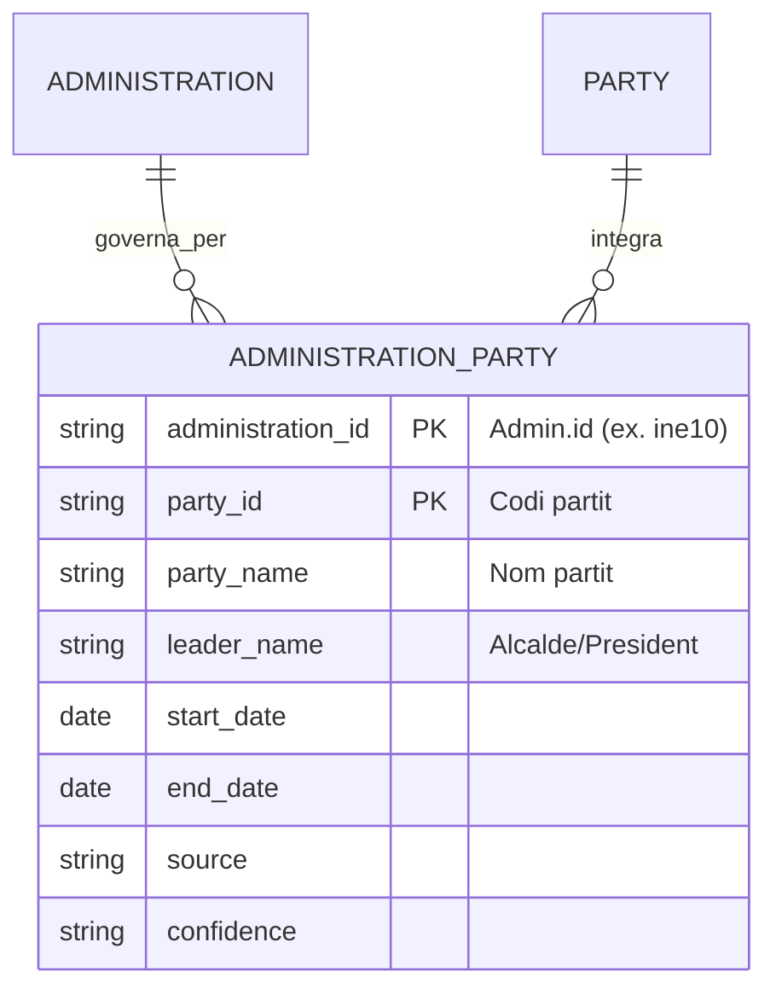
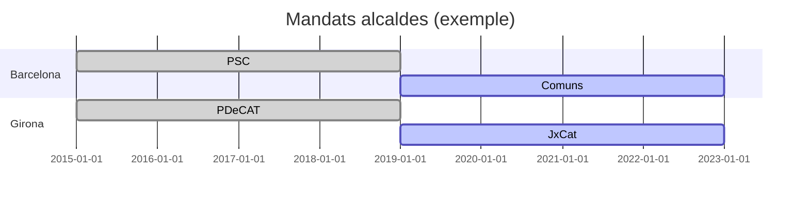

# Resum executiu  
Per identificar el partit polític que governa cada administració local i analitzar la contractació segons “color” polític, cal integrar dades oficials d’alcaldes/presidents amb la base de contractes ja disponible. Per fer-ho, podem fer servir registres oberts dels governs estatal i autonòmic (**portal MPT de Concejales/Alcaldes**, **dades obertes de la Generalitat de Catalunya**) i connexions amb fonts electoral oficials. S’elaborarà una taula nova, `administration_party`, on es registrarà per a cada administració (Ajuntament, Diputació, etc.) el partit del cap (alcalde o president), amb la persona responsable i dates de mandat. Aquestes dades provenen de fonts públiques com el portal de dades del Ministeri de Política Territorial (registre de tots els alcaldes amb “indicació de la llista per la qual van ser elegits”) i de la Generalitat (dataset “Historial d’alcaldes/esses” per a Catalunya i “Càrrecs electes dels ens locals”). També aprofitarem conjunts de dades locals (p. ex. CKAN de l’Ajuntament de Girona amb resultats electorals històrics) i fonts complementàries (butlletins oficials, webs institucionals, etc.) per cobrir tota la informació. El procés consisteix en escrapear/descàrregar aquestes dades, normalitzar identificadors (INE10, DIR3, NIF, noms estandarditzats) i omplir la taula `administration_party`. Posteriorment s’implementarà un connector Python (o diversos, reutilitzant l’estructura actual de Fair Factory) per fer la ingesta de manera automàtica, validant resultats i generant tests/fixtures. Les consultes SQL que en resultin permetran associar cada contracte al partit del seu govern local (segons data) i calcular, per exemple, nombre de contractes i import total/mitjà per partit i per any. Dins la web de Fair Factory, afegirem una secció “Fonts i metodologia” explicant aquestes dades, un filtre d’exploració per partit i gràfics (sèries temporals, diagrames de barres i mapes temàtics) per visualitzar indicadors agregats per partit. Es tindrà en compte la privacitat (les dades de càrrecs públics són públiques i reutilitzables) i la transparència (citar fonts oficials, esmentar llicències CC), assegurant un ús ètic (els alcaldes són figures públiques, però cal ser neutres en interpretacions).

## 1. Fonts de dades i mètodes  
**Fonts prioritàries** (totes públiques): registres oficials d’alcaldes/regidors i presidents d’ens locals. Exemples:  

- **Ministeri Política Territorial (Portal MPT)**: “Registro de alcaldes” que ofereix una *base de datos de los alcaldes y concejales de todos los municipios españoles, con indicación de la lista por la que fueron elegidos* (enllaç HTML amb cerca per província/municipi o descàrrega d’XLS). La interfície Redsara del MPT també permet baixar llistats d’alcaldes per legislatura.  
- **Generalitat de Catalunya – Dades Obertes**:  dos conjunts claus:  
  - *Historial d’alcaldes/esses dels municipis catalans (1979–avui)*, dataset Socrata (CSV/JSON) amb història de tots els alcaldes catalans.  
  - *Càrrecs electes dels ens locals* (Socrata) amb els càrrecs vigents: alcaldes, regidors, consellers comarcals, diputats provincials, presidents de mancomunitats, etc. (inclou partit i càrrec actual).  
- **Dades electorals oficials**:  conjunt de dades com el disponible a l’Ajuntament de Girona (CKAN) amb resultats històrics de vots per partit (1979–2023), que inclou tots els “ens locals” de Catalunya. (També la Junta Electoral o butlletins oficials publiquen resultats post-electorals detallats per ajuntament).  
- **Webs institucionals**: catàlegs municipals, webs de les diputacions, **DOGC/BOE** amb actes d’investidura, etc. (serveixen de suport quan manquin dades oficials massives).  
- **Fonts secundàries**: Wikipedia (per contrast ràpid de partits d’alcaldes en cas de dubte), bases CKAN locals (Madrid, Andalusia, etc.), portals autonòmics (p. ex. *datos.aragon.es*, *opens data Comunitat Valenciana*).  

**Mètodes d'obtenció**: combinarem APIs i descàrregues de CSV/JSON amb scraping. Els datasets de la Generalitat es poden descarregar directament o consultar via Socrata API (CSV/JSON: e.g. `.../export.csv?accessType=DOWNLOAD`). El portal SEU-e (Girona) permet accés CKAN (e.g. `https://dadesobertes.seu-e.cat/api/action/datastore_search?resource_id=...&filters={"CODI_ENS":"1707920002"}`). Per fonts HTML (portal Redsara, webs d’ajuntament) farem peticions HTTP amb `requests` o `BeautifulSoup`. S’establirà un procediment de *normalització* amb identificadors únics: el codi **INE10** (municipi) i **DIR3** (ens local), que apareixen sovint als datasets, a més del **NIF** (per alguns ajuntaments o diputacions) i noms oficials estandarditzats (sense accents, majúscules consistents). Així es pot enllaçar cada càrrec al mateix `administration_id` utilitzat per les contractes. 

## 2. Model de dades proposat  
Es crearà la taula `administration_party` amb aquesta estructura bàsica:  

| Columna           | Tipus    | Descripció                                                        |
|-------------------|----------|-------------------------------------------------------------------|
| `administration_id` | TEXT (FK) | Identificador intern de l'administració (coincideix amb `administration.id`). |
| `party_id`          | TEXT     | Codi del partit (curt, p. ex. PSC, ERC).                           |
| `party_name`        | TEXT     | Nom complet del partit (p. ex. “Partit dels Socialistes de Catalunya”). |
| `leader_name`       | TEXT     | Nom de l'alcalde/president que ostenta el càrrec (fins opcional).   |
| `start_date`        | DATE     | Data d'inici del mandat (p. ex. investidura).                       |
| `end_date`          | DATE     | Data de finalització (sera NULL si continua).                       |
| `source`            | TEXT     | Font de la informació (URL o descripció breu de l’origen).         |
| `confidence`        | TEXT     | Nivell de confiança (p.e. “alta” per fonts oficials, “mitjana” si és secundària). |

En el nostre model, cada administració pot aparèixer diversos cops (per diferents mandats). El camp *clau primària* pot ser (`administration_id`, `start_date`) o bé un autoincrement id propi. Caldrà també taules auxiliars (`administration`, `party`…), però al mínim a `administration_party` triem guardar directament nom del partit en lloc de fer join addicional.  



Aquest diagrama (`mermaid erDiagram`) mostra com `administration_party` vincula cada administració amb el partit del cap de govern. Amb aquesta taula es podrà fer *joins* directes amb la taula d’administracions i amb la de contractes, agrupant per partit/any.

## 3. Estratègia d’ingesta  
S’implementarà un o diversos **connectors Python** dins l’arquitectura existent (basada en `Connector.run()` de Fair Factory). Per exemple:  

- **HistorialAlcaldesConnector**: consulta l’API de la Generalitat (`analisi.transparenciacatalunya.cat`) per obtenir tot l’historial a Catalunya. Crea registres en `administration_party` amb les columnes corresponents (partit, alcaldes, dates).  
- **CargosElectesConnector**: descarrega el dataset de càrrecs vigents (Socrata CSV/JSON), extraient l’actual alcalde de cada municipi català (i president de Diputació/comarca, si cal) amb el seu partit.  
- **MPTAlcaldesConnector**: per a l’àmbit estatal, “escaparem” el portal Redsara o usare les descàrregues XLS: per cada província es pot baixar el full d’Alcaldes/Concejales 2019-2023 (exemple: formularis disponibles en *concejales.redsara.es*). D’aquestes taules s’obté l’alcalde i partit. (Com a alternativa, es pot utilitzar l’API interna del Ministeri si existeix, o bé llista de **Junta Electoral**.)  
- **EleccionsMunicipalsConnector**: integra resultats electorals històrics (p. ex. des del CKAN de Girona o de la Generalitat), calculant quina llista va guanyar cada elecció local (és a dir, el partit de l’alcalde electe). Aquesta font pot tenir prioritats mitjanes (cal desambiguar coalicions).  

Cada connector llegeix la seva font (CSV/JSON/HTML), *parsing* les columnes, i fa inserts a la BD SQLite (`db.py`). Els logs podran indicar què s’ha fet. És fonamental validar les dades a la ingesta: per exemple, si la font retorna zero registres inesperadament, es llença un error per evitar publicar dades incompletes. En condensat:  

```python
class Connector(ABC):
    def ingest(self) -> int:
        # 1. Obtenir dades des de la font externa (API, CSV, scraping)
        # 2. Normalitzar identificadors (INE10, DIR3, NIF)
        # 3. Omplir taula administration_party amb (administration_id, party_id, ...) 
        # 4. Validar: cal més de 0 registres per font vàlida
        # 5. Retornar nombre de registres inserits
```

Caldrà afegir proves unitàries (`tests/fixtures`) per cada connector nou. Per exemple, un fixture pot ser un CSV petit amb 2 municipis i els seus alcaldes; el test comprova que `ingest()` escriu correctament dues files a `administration_party`. També s’hauria d’incloure el nou conector a la llista `CONNECTORS` i en el pipeline de GitHub Actions (scripts amb `--administracion` si escau). El workflow (Actions) es pot modificar perquè cada grup (`catalunya`, `asturias`, etc.) inclogui el connector de partits on correspongui. Després de la ingesta, es recomana actualitzar el `manifest.json` amb els nous comptatges (p. ex. nombre d’administracions amb info de partit) i mostrar-ho a la web.

### Validació i qualitat de dades  
S’estableix que cadascun dels connectors reporti errors difícils (exceptions) quan la font completa no estigui disponible. Per exemple, si un conector de les eleccions recupera 0 registres però abans en tenia 100, s’hauria de considerar fallida i no sobreescriure la base. Això evita publicar registres totals errats. També es poden definir metrics de coherència (períodes continus de mandat sense solapaments, format correcte de codis). Cada ingesta generarà un resum en la taula `ingest_run` (com ja hi ha) indicant la font, l’estat *OK*/*ERROR*, i un missatge (p. ex. “10/10 municipis processats”). D’aquesta manera es facilita el diagnòstic si, per exemple, una administració queda sense partit per error d’ingesta.

## 4. Tractament d’incerteses  
Els primers paquets electorals (1983, 1987, etc.) poden ser incomplets; es recomana documentar-los com a històrics. Per partits nous o coalicions: normalitzar els noms (p.e. “Entesa”, “ERC”, “PSC-PSOE”, etc.) i, si un alcalde esdevé part d’una coalició d’equips, assignar el partit principal. Per canvis interins (renúncies, morts): cal dividir el registre en dos (fi d’un mandat, inici d’un altre). En aquests casos, la font original (acta oficial, web municipal) i la confiança baixa, ja que no hi ha dataset automatitzat. Se suggereix incloure un camp `confidence = "Baixa"` en registres dubtosos (ex. obtinguts de Wikipedia) i “Alta” per fonts oficials. També caldrà llistar explícitament els casos de coalició o alineació diversa com a metadades (p. ex. “Coalició d’ERC + Comuns, formació conjunta”).

## 5. Consultes SQL d’exemple  
Un cop poblada `administration_party`, es poden fer joins amb la taula de contractes. Per exemple, per calcular el nombre i import de contractes adjudicats per any i per partit: 

```sql
SELECT ap.party_name,
       c.year,
       COUNT(*) AS count_contractes,
       SUM(c.amount) AS import_total,
       AVG(c.amount) AS import_mitja
FROM administration_party AS ap
JOIN administrations AS a ON a.id = ap.administration_id
JOIN contracts AS c ON c.administration_id = a.id
-- Assegurar que el contracte cau dins del mandat:
WHERE c.date >= ap.start_date AND (ap.end_date IS NULL OR c.date <= ap.end_date)
GROUP BY ap.party_name, c.year
ORDER BY c.year, count_contractes DESC;
```

Aquesta consulta (adaptable) associa cada contracte amb el partit del govern local en aquell any, i calcula total, mitjana i nombre per partit i any. S’hi podrien afegir altres filtres (per tipus de contracte, import mínim, etc.). Per extreure percentatges també es pot unir amb subconsultes generals.

## 6. Propostes d’interfície web  
A la web de Fair Factory crearem una secció **“Fonts i metodologia”** on es documenti clarament d’on vénen aquestes dades (p.e., “Registre d’alcaldes del Ministerio [1] i *datasets* de la Generalitat”), quan s’actualitzen i quantes administracions cobreixen. També un visor de partits: un menú desplegable per filtrar l’anàlisi de contractació per partit (o coalició).  

Per a visualitzacions, es poden afegir gràfics que relacionin partits i contractació: per exemple, un gràfic de **línies temporals** que mostri cada any l’import total de contractes dels governs d’un partit concret; un **diagrama de barres** comparatiu de partits (número de contractes o despesa total en un període); un **mapa temàtic** on cada ajuntament aparegui en el color del partit governant (creant un mapa autonòmic/municipal per visualitzar la distribució de partits). També es poden fer gràfics de sectors (quota % per partit). Per exemple, mermaid podria utilitzar-se per mostrar un **timeline** o un **gant** dels mandats de cada alcalde: 



…i un **diagrama d’entitats** (ER) per il·lustrar el model de dades (com al codi anterior). També es poden incorporar imatges explicatives (p.e. **mapes de Catalunya** per partit) tretes d’eines GIS amb dades pròpies (fent “embed_image” de mapes estilizats). En resum, la interfície hauria de permetre a l’usuari jugar amb el filtre de partit i veure com varien els indicadors de contractació (mitjana d’import, % de contractes menors, etc.) per color polític.

## 7. Consideracions legals i ètiques  
Les dades d’alcaldes i partits són informació pública (els càrrecs electes són figures públiques), normalment publicades sota llicències lliures (p. ex. CC0 de la Generalitat). Cal revisar sempre la llicència de cada font (els *datasets* citats de la Generalitat són CC0). El lloc ha d’indicar sempre l’origen (“font: dades obertes Generalitat, Ministeri…”), tal com exigeix la normativitat de reutilització. Atès que tractem noms de persones, s’aplica que es tracta de **dades públiques de persones públiques**: és legal publicar nom d’un alcalde i partit, ja que aquesta info ja és pública (no hi ha dades sensibles). Èticament, cal evitar judicis o sesgos de color polític; Fair Factory només mostrarà dades i indicadors calculats (p. ex. *% del pressupost gastat en contractació* per partit), deixant als usuaris qualsevol interpretació política. Els possibles casos de coalicions es poden anotar, però no atribuirem unilateralment un “perfil de contractació” a un partit de coalició sense contextualitzar-ho. Finalment, cal respectar les condicions de reutilització (p.ex. no falsificar fonts, no fer-ne ús comercial si alguna llicència ho prohibeix).

## 8. Pla d’implementació i passos següents  

Seguint el model de GitHub actual, els passos clau serien: 

1. **Definir esquema**: crear la taula `administration_party` en el SQL (ja hem detallat camps). (Complexitat: **Baixa**).  
2. **Extraure fonts**: localitzar i descarregar les fonts (CSV/API/HTML). Preparar les crides a la Socrata i a Redsara. (Molta feina: **Mitjana-Alta**).  
3. **Connector Python**: implementar connectors nous/extensos (p.ex. `HistorialAlcaldesConnector`, `CargosElectesConnector`, `MPTAlcaldesConnector`). Omplir SQLite seguint esquema. (Complexitat: **Mitjana**).  
4. **Validació i tests**: crear tests automatitzats (pytest) amb fitxers d’exemple (p.e. un mini-CSV amb alguns municipis). Assegurar que `ingest()` maneja errors (issues #13 i #14 del *roadmap*). (Complexitat: **Mitjana**).  
5. **Integració pipeline**: ajustar el script CLI i el workflow CI (GitHub Actions) perquè cridi els nous connectors en el grup corresponent i re-checkpoint la base. Actualitzar `manifest.json` amb les noves dades comptades i dates d’actualització. (Complexitat: **Baixa**).  
6. **Consultes SQL/Visualització**: redactar les queries d’agrupament per partit com a referencia per futurs usuaris. Implementar vistes o funcions d’agregació si cal. (Complexitat: **Mitjana**).  
7. **UI i documentació web**: afegir pàgina “Fonts i metodologia” explicativa amb referències (s’exemple,), camps recents i llicències. Implementar filtre per partit a la UI actual i els gràfics descrits (modificant `docs/index.html` i CSS/JS associats). (Complexitat: **Mitjana**).  
8. **Revisió legal/ètica**: confirmar llicències i permisos, incloure menció d’orígens i llicències (ex. “dades obertes Generalitat (CC0)”), i evitar el tracte de dades personals sensibles. (Complexitat: **Baixa**).  
9. **Control de qualitat**: un cop desplegat, revisar regularment que les ingestes funcionin (checks de zero resultats inesperats, etc.), mantenint el registre d’errors en `ingest_run`.  

### Taules de resum  

#### Fonts prioritàries  

| Font / Descripció                                  | URL exemple (mètode accés)              |
|----------------------------------------------------|------------------------------------------|
| **Ministeri Política Territorial – Registre alcaldes** (espanyol) – *Base de datos d’alcaldes amb partit* | https://datos.gob.es/catalogo/e05232701-registro-de-alcaldes (Web/Redsara Excel) |
| **Generalitat (dades obertes) – Historial d’alcaldes** (Catalunya) – CSV/JSON Socrata. | *Soc​​rata API:* `analisi.transparenciacatalunya.cat/api/v3/views/2v2p-vu4h/` |
| **Generalitat – Càrrecs electes dels ens locals** (Catalunya) – CSV/JSON Socrata (alcaldes/regidors actuals). | Socrata API: `analisi.transparenciacatalunya.cat/api/v3/views/m5nd-xjza/` |
| **Ajuntaments – CKAN “Eleccions municipals”** (Girona & altres) – resultats vots històrics. | CKAN API (AOC): p.e. `dadesobertes.seu-e.cat/api/3/action/datastore_search?resource_id=...` |
| **Portal MPT / Redsara** – llistats oficials per municipi (Alcaldes/Concejales 2019-2023). | https://concejales.redsara.es/consulta (Web/descàrrega XLS) |
| **Junta Electoral Central / BOE** – acta de resultats oficials (web/PDf). | ex. https://www.congreso.es (no direct API, scrap del BOE) |
| **Wikipedia local** – per contrast (si cal). | e.g. https://ca.wikipedia.org/wiki/Ajuntament_de_Girona |

#### Esquema de `administration_party`  

| Columna         | Tipus  | Descripció                                                      |
|-----------------|--------|-----------------------------------------------------------------|
| `administration_id` | TEXT   | ID de l’administració (clau forana a `administration.id`).      |
| `party_id`      | TEXT   | Codi abreujat del partit polític (p. ex. “PSC”).                |
| `party_name`    | TEXT   | Nom complet del partit (“Partit dels Socialistes de Catalunya”).|
| `leader_name`   | TEXT   | Nom del càrrec electe (alcalde/president).                       |
| `start_date`    | DATE   | Inici del mandat (data).                                        |
| `end_date`      | DATE   | Fi del mandat (NULL si és actual).                              |
| `source`        | TEXT   | Font de la informació (e.g. URL dataset).                       |
| `confidence`    | TEXT   | Fiabilitat (“Alta” per fonts oficials, “Mitjana” si és secundària). |

#### Checklist d’implementació  

| Tasca                                                                 | Complexitat |
|-----------------------------------------------------------------------|:-----------:|
| Definir/escriure l’esquema SQLite `administration_party`.            | Baixa       |
| Recollir i normalitzar fonts: Socrata, CKAN, web crawling i descàrrega. | Mitjana     |
| Implementar connectors Python (Caldeoner  a `connectors/`).           | Mitjana     |
| Crear test/fixture per cada connector nou.                           | Mitjana     |
| Validar ingestes (control d’errors, comptatge correctes).           | Mitjana     |
| Extendre `ingest-and-publish.yml` per incloure nous connectors.      | Baixa       |
| Afegir consultes SQL i vistes (agrupacions per partit).              | Baixa       |
| Desenvolupar UI: pàgina fonts, filtre partit, nous gràfics.         | Mitjana     |
| Revisar llicències i privacitat.                                     | Baixa       |
| Documentar procés (README/docs, manifest.json).                      | Baixa       |

Cada tasca tindrà criteris d’acceptació clars: per exemple, “tots els alcaldes coneguts (Catalunya, Girona, etc.) han estat introduïts amb partit correcte”, els tests unitàries passen, i la web mostra la llista de partits disponible per a filtre. D’aquesta forma, en concluir els passos anteriors, Fair Factory tindrà integrades les dades polítiques de cada administració, podent analitzar la contractació associada a cada color polític. 

**Fonts:** Govern d’Espanya (Ministeri Pol. Territorial, Portal MPT); Generalitat de Catalunya (dades obertes: alcaldes històrics, càrrecs actuals); portals municipals (e.g. Girona). Aquestes fonts primàries, totes en català/espanyol, aporten les dades necessàries per al projecte.